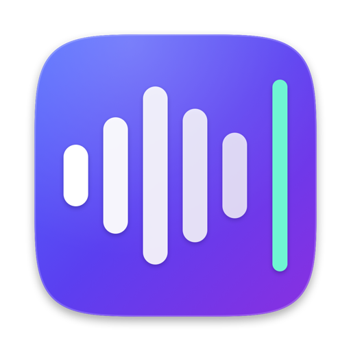
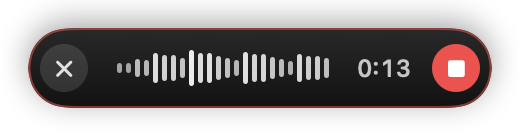
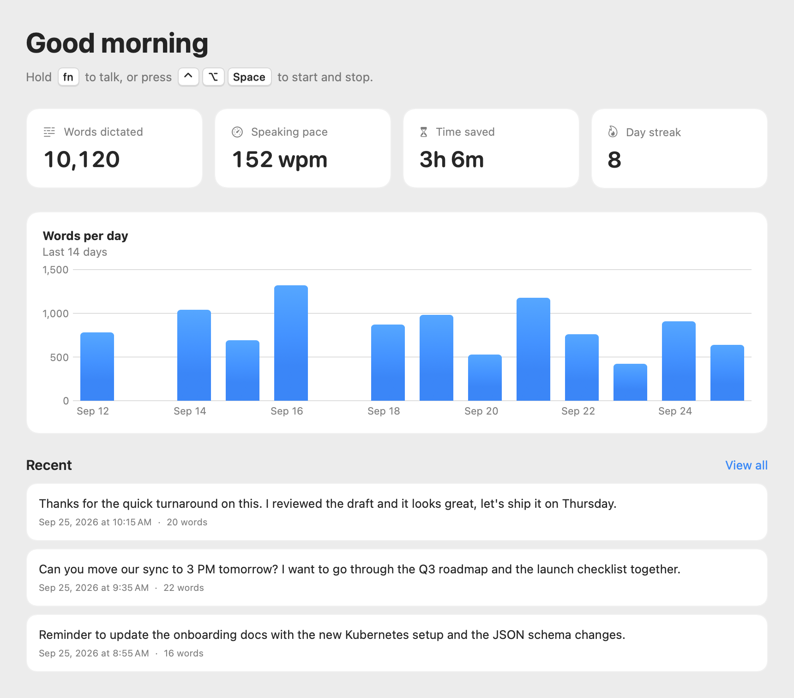

<p align="center">
  
</p>

<h1 align="center">Flowtype</h1>

<p align="center">
  <strong>Hold Fn, speak, and your words are typed into any app on your Mac.</strong><br>
  Private, on-device dictation for macOS.
</p>

<p align="center">
  <a href="https://github.com/yashgo0018/flowtype/releases/latest/download/Flowtype.dmg"><strong>Download for Mac</strong></a> ·
  <a href="https://yashgo0018.github.io/flowtype/">Website</a> ·
  <a href="PRIVACY.md">Privacy</a>
</p>

<p align="center">
  
</p>

## Features

- **Works in every app.** Mail, Slack, Notion, browsers, code editors, Terminal: if there's a text cursor, Flowtype can type there.
- **Private by default.** Speech is transcribed on your Mac with [Whisper](https://github.com/openai/whisper). Audio is kept in memory only and never saved.
- **Dictionary.** Teach it names, jargon and acronyms so they're spelled right every time.
- **Snippets.** Say a short cue like “my calendar link” and get the full text.
- **Careful with your data.** Flowtype won't dictate into password fields, and it restores your clipboard after pasting.
- **History and stats.** Search past dictations and see your words, speaking pace, time saved and streak.
- **Choice of engine.** On-device Whisper (Base, Small or Large v3 Turbo), or Groq cloud transcription with your own API key.
- **Automatic updates**, signed and notarized by Apple.

<p align="center">
  
</p>

## Install

1. [Download Flowtype.dmg](https://github.com/yashgo0018/flowtype/releases/latest/download/Flowtype.dmg), open it, and drag **Flowtype** to **Applications**.
2. Open Flowtype. The Home screen walks you through setup:
   - **Microphone**, to hear you.
   - **Accessibility**, to type into other apps and detect the push-to-talk key.
   - **Speech model**, downloaded once (about 480 MB for the default model).
3. Optional: in **System Settings → Keyboard**, set **“Press 🌐 key to”** to **Do Nothing**, so holding Fn doesn't also open the emoji picker.

Requires macOS 14 Sonoma or later on Apple silicon.

## Use

| Action | Shortcut |
| --- | --- |
| Push-to-talk | Hold **Fn** (or Right ⌥ / ⌘ / ⌃), speak, release |
| Hands-free | **⌃⌥Space** to start, again to stop. Hold it to use it as push-to-talk. |
| Cancel | **Esc** while dictating |
| Paste last transcript | **⌃⌘V** |

Shortcuts can be changed in **Settings**. Open Flowtype from the Dock, from the menu bar icon, or with the button on the dictation bar, which also has a right-click menu.

## Troubleshooting

- **Text is copied instead of typed:** Flowtype needs Accessibility permission. If System Settings shows it switched on but it still doesn't work, click **Already on?** on the Home screen to reset and re-grant it.
- **“No sound from the microphone”:** choose your input device in **Settings → Transcription → Microphone**.
- **Holding Fn does something else:** see step 3 of Install, or pick a different push-to-talk key in Settings.
- **Logs:** open Console.app and filter by subsystem `studio.infinitumlabs.flowtype`. Transcript text is never logged.

Something else? [Open an issue](https://github.com/yashgo0018/flowtype/issues).

## Privacy

Flowtype has no accounts, analytics or telemetry. With on-device transcription, your audio never leaves your Mac. History, stats, your dictionary, snippets and notes are stored locally in `~/Library/Application Support/Flowtype`. See [PRIVACY.md](PRIVACY.md) for details, including what's sent when you choose Groq.

## Build from source

Requires Xcode 26 or later.

```bash
git clone https://github.com/yashgo0018/flowtype.git
cd flowtype
open Flowtype.xcodeproj
```

Run the **Flowtype** scheme on **My Mac**, or build and test from the command line:

```bash
xcodebuild -project Flowtype.xcodeproj -scheme Flowtype -destination 'platform=macOS,arch=arm64' build
xcodebuild test -project Flowtype.xcodeproj -scheme Flowtype -destination 'platform=macOS,arch=arm64'
```

Builds are signed with the Infinitum Consulting team. To build under your own account, change the team in **Signing & Capabilities**.

### Project layout

| Path | What's there |
| --- | --- |
| `Flowtype/AppStateController.swift` | Dictation state machine: record → transcribe → paste |
| `Flowtype/AudioRecorder.swift` | 16 kHz mono capture, levels, microphone selection |
| `Flowtype/Transcription.swift` | WhisperKit (on-device) and Groq transcription |
| `Flowtype/PasteService.swift` | Typing into the frontmost app, clipboard restore |
| `Flowtype/HotKeyService.swift` | Global shortcuts and the push-to-talk key |
| `Flowtype/TextProcessing.swift` | Transcript cleanup, dictionary and snippets |
| `Flowtype/FlowBar.swift` | The floating dictation bar |
| `Flowtype/*Views.swift` | The Hub window: Home, History, Dictionary, Snippets, Notes, Settings |
| `docs/` | The website, served by GitHub Pages |
| `scripts/` | Release script and icon generator |

Releases are documented in [RELEASING.md](RELEASING.md).

## Acknowledgements

Flowtype is built on [WhisperKit](https://github.com/argmaxinc/WhisperKit) and OpenAI's [Whisper](https://github.com/openai/whisper) models, and uses [Sparkle](https://sparkle-project.org) for updates. The full list is in the app under **Settings → About**.

© 2026 Infinitum Consulting LLC
